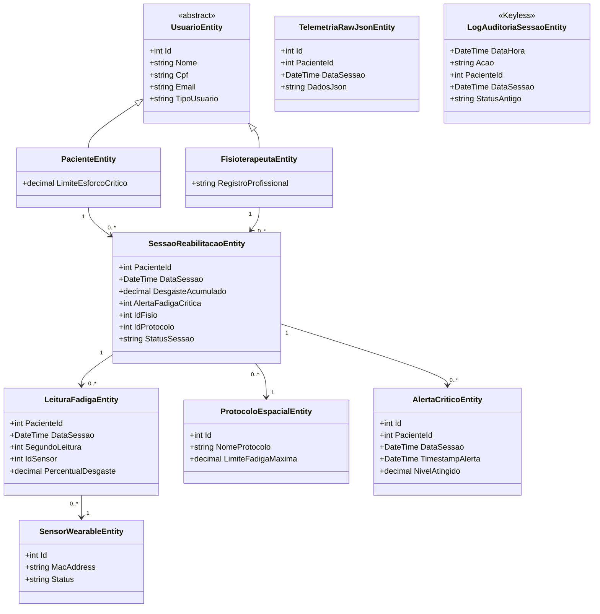

# 🌌 VOID - Space Telemetry & Biometric Rehabilitation (.NET API)


Este repositório contém a **API RESTful em C# (.NET)** do projeto VOID, responsável por orquestrar as regras de negócio, a segurança e a persistência dos dados de telemetria espacial aplicados à reabilitação física.

O sistema coleta, valida e armazena leituras de fadiga de sensores IoT (ESP32) para prevenir lesões durante as sessões de fisioterapia, utilizando algoritmos baseados em padrões de microgravidade da ISS.

---

## 👥 Equipe de Desenvolvimento (2TDSPO)

- **Pedro Henrique Luiz Alves Duarte RM563405**
- **Guilherme Macedo Martins RM562396**
- **Henrique Martins RM563620**

---

## 🔗 Links e Entregáveis do Projeto

- **Apresentação e Demonstração (Vídeo 8 min):** [Insira o link do YouTube aqui]
- **Vídeo Pitch (3 min):** [Insira o link do Pitch aqui]


---

## 📊 Diagramas

### Modelo Entidade-Relacionamento (Classes C#)



---

## 🏗️ Desenvolvimento, Arquitetura e Boas Práticas

A API foi projetada com foco em **Clean Code**, **Alta Coesão** e **Boas Práticas de Engenharia de Software**, utilizando os melhores recursos do ecossistema .NET.

### 🔹 Data Transfer Objects (DTOs)

Isolamento absoluto entre as entidades do banco de dados (**Models**) e os contratos de **Request/Response** da API.

Benefícios:

- Evita vazamento de dados sensíveis.
- Impede ataques de Overposting.
- Mantém desacoplamento entre domínio e interface.

### 🔹 Global Exception Handling (Middleware)

Implementação de um middleware customizado (`GlobalExceptionMiddleware.cs`) para captura global de exceções.

Funcionalidades:

- Retorno padronizado em JSON.
- Tratamento de erros de validação (`400 Bad Request`).
- Tratamento de erros internos (`500 Internal Server Error`).
- Ocultação de Stack Trace em ambiente de produção.

### 🔹 Autenticação Stateless (JWT)

Segurança baseada em Tokens Bearer.

Características:

- Autenticação Stateless.
- Controle de acesso por perfis.
- Proteção das rotas de telemetria e prontuários.

### 🔹 Entity Framework Core & Migrations

Persistência relacional utilizando a abordagem **Code First**.

Vantagens:

- Controle de versão do banco.
- Rastreabilidade das alterações.
- Criação automatizada do schema Oracle.

### 🔹 Relacionamentos (1:N e Herança)

A modelagem contempla:

- Herança (**Table-Per-Type**).
- Relacionamento 1:N entre Paciente e Sessão.
- Relacionamentos entre Sessões, Protocolos e Leituras de Fadiga.

### 🔹 Data Annotations

Validações declarativas nos DTOs utilizando:

```csharp
[Required]
[EmailAddress]
[Range]
```

Garantindo que requisições inválidas sejam rejeitadas antes de atingir os Controllers.

---

## 🚀 Instruções de Acesso e Execução

### Pré-requisitos

- .NET SDK 8.0
- Oracle Database
- Entity Framework Core Tools

### 1. Clonar o Repositório

```bash
git clone (https://github.com/GS-Void/advanced-business-development-with-.net.git)
cd Void.API
```

### 2. Configurar o appsettings.json

Configure:

```json
{
  "ConnectionStrings": {
    "OracleConnection": "..."
  },
  "JwtSettings": {
    "SecretKey": "..."
  }
}
```

### 3. Aplicar as Migrations

```bash
dotnet ef database update
```

### 4. Executar a Aplicação

```bash
dotnet run
```

---

## 📖 Swagger

Após iniciar a aplicação, acesse:

### HTTP

```text
http://localhost:5000/swagger
```

### HTTPS

```text
https://localhost:5001/swagger
```

---

## 🧪 Parte de Testes e Exemplos de Uso

A aplicação pode ser testada através de:

- Swagger
- Postman
- Insomnia
- cURL

---

### 🔐 Exemplo de Teste 1 — Autenticação

**Endpoint**

```http
POST /api/auth/login
```

**Payload**

```json
{
  "email": "paciente@void.com",
  "senha": "senhaSegura123"
}
```

Após receber o Token JWT, utilize-o nas próximas requisições:

```http
Authorization: Bearer <token>
```

---

### 📡 Exemplo de Teste 2 — Ingestão de Telemetria

**Endpoint**

```http
POST /api/telemetria
```

**Payload**

```json
{
  "sessaoId": 1,
  "batimentosPorMinuto": 145,
  "temperaturaCorporal": 38.5,
  "fadigaMuscularPercentual": 82.0
}
```

**Resposta Esperada (201 Created)**

```json
{
  "mensagem": "Telemetria registrada. ALERTA: Limite de fadiga crítico atingido (>80%).",
  "idLeitura": 1045
}
```

---

## 🎯 Objetivos do Projeto

- Monitorar pacientes em tempo real.
- Detectar níveis críticos de fadiga muscular.
- Auxiliar fisioterapeutas na tomada de decisão.
- Reduzir riscos de lesões durante reabilitação.
- Aplicar conceitos da indústria aeroespacial à saúde.
- Contribuir para a **ODS 3 — Saúde e Bem-Estar**.

---

## 📄 Licença

Projeto desenvolvido para fins acadêmicos como parte da **Global Solution FIAP 2026**.

---

<div align="center">

# 🌌 VOID

### Space Telemetry & Biometric Rehabilitation

**Global Solution FIAP 2026**

🚀 Tecnologia Espacial Aplicada à Saúde Humana

</div>
